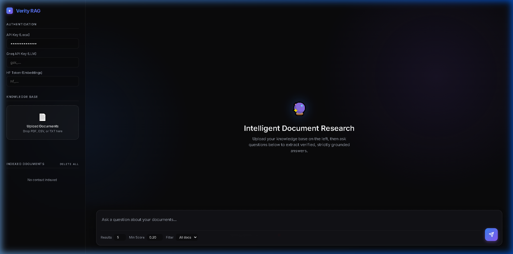
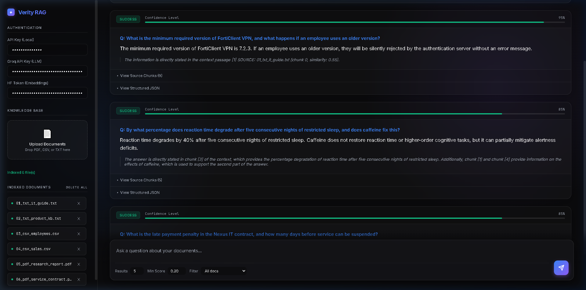

# Verity Dual-Path RAG

An AI agent that demonstrates **Intelligent Routing → Dual-Execution → Verified Synthesis** in a single end-to-end workflow.

Given a user query and a heterogeneous knowledge base (PDFs, TXT, CSVs), the agent:

1. **Routes** the query dynamically as either `SEMANTIC` or `ANALYTICAL` via an LLM
2. **Executes** either a Vector Database search (for text) or an isolated Pandas script (for math/tables)
3. **Synthesizes** the exact source chunks or Python console output into a verified, 0-hallucination answer

Built with FastAPI + Groq (Llama 3.3) + HuggingFace Embeddings + Pandas.

---

## Demo

**Empty state** — upload zone, credential inputs, and indexed document list:


**Live query** — 95% confidence answer grounded in source documents with full citation trace:


---

## Stack

| Layer | Technology |
|---|---|
| Web framework | FastAPI |
| LLM inference | Groq API (llama-3.3-70b-versatile) |
| Embeddings | HuggingFace Serverless (all-MiniLM-L6-v2) |
| Data Execution | Python Pandas |
| Vector DB | Custom JSON persistence |
| Frontend | Vanilla HTML/CSS/JS (Glassmorphism) |

---

## Setup

### 1. Clone the repo

```bash
git clone https://github.com/NeoMan-dev/verity-dual-path-rag.git
cd verity-dual-path-rag
```

### 2. Install dependencies

```bash
python -m pip install -r requirements.txt
```

> **Note:** Use `python -m pip` instead of `pip` directly to ensure packages install for the correct Python version.

### 3. Get your credentials

**Groq API Key** (free)
- Sign up at [console.groq.com](https://console.groq.com)
- Go to API Keys → Create new key

**HuggingFace Access Token** (free)
- Sign up at [huggingface.co](https://huggingface.co)
- Go to Settings → Access Tokens → Create a "Read" token

### 4. Run the server

```bash
python -m uvicorn main:app --reload
```

> **Note:** Use `python -m uvicorn` instead of `uvicorn` directly if you get a `command not found` error.

Open [http://localhost:8000](http://localhost:8000) in your browser.

### 5. Use the agent

Click the `⚙️` icon in the top right to open the settings panel:
- **Groq API Key** — from step 3
- **HuggingFace Token** — from step 3

Drag and drop your files (`.txt`, `.pdf`, `.csv`) into the left dropzone. Type your question in the bottom bar, hit submit, and watch the pipeline execute.

---

## Architecture

```
User Query
    │
    ▼
[ ROUTING — LLM Call 1 ]
  Groq / Llama 3.3 → classifies as SEMANTIC or ANALYTICAL
    │
    ├── SEMANTIC PATH (Text/PDFs) ──┐
    │     HuggingFace Embeddings    │
    │     Vector Cosine Search      │
    │                               │
    └── ANALYTICAL PATH (CSVs) ─────┤
          Groq writes Pandas code   │
          sandbox executes code     │
                                    ▼
                        [ SYNTHESIS — LLM Call 2 ]
                          Groq format final answer
                                    │
                                    ▼
                                [ ACTION ]
                          UI displays answer + trace
```

---

## Project Structure

```
verity-dual-path-rag/
├── main.py           # FastAPI app + Routing logic
├── generation.py     # Groq LLM calls + Pandas sandbox
├── embeddings.py     # Chunking, Tokenization, and Vector logic
├── ingestion.py      # PDF/CSV/TXT parsing extraction
├── index.html        # Frontend UI
├── requirements.txt  # Dependencies
└── README.md
```

---

## Notes

- **Zero-Trust Credentials**: All API keys (Groq, HuggingFace) are entered in the UI at runtime and are never stored in the repository or local environment files.
- **Analytical Execution**: The engine dynamically generates and executes Pandas code against local CSV data. For production-grade security, this should be run within a restricted containerized sandbox.
- **Technical Considerations**:
    - **Document Parsing**: Optimized for text-heavy PDFs, CSVs, and TXT files. Complex multi-column layouts, nested tables, or image-only PDFs (without OCR) may result in reduced retrieval accuracy.
    - **Performance**: Queries are capped at 1,000 characters to ensure low-latency LLM processing.
    - **Embeddings**: Utilizes HuggingFace Serverless Inference; initial requests after inactivity may incur a brief cold-start delay (~10s).
    - **Persistence**: Implements a custom JSON-backed vector store for easy local portability without requiring a dedicated database server.
    - **Compatibility**: Built and tested on Python 3.10+.
- **Rate Management**: High-volume analytical processing on large datasets is subject to provider-level API rate limits (e.g., Groq's daily token caps).
- **Optimized Retrieval**: To maintain high-quality synthesis, the system defaults to `top_k=15` with a configurable `min_score` threshold.

